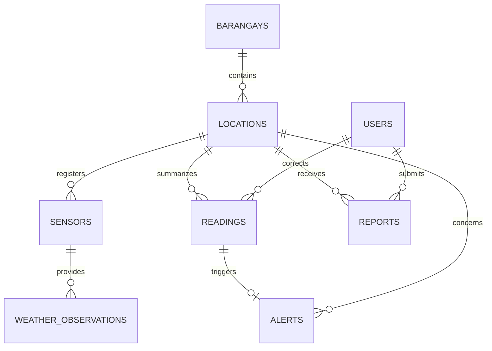

# SmartSlope Progress 2 database design

Study area: Barangay Irisan, Baguio City. `db.sql` is authoritative for a new installation; `sql/migrate_existing_to_aligned.sql` upgrades a populated `smartslope_mvp` made with `smartslope` main `389a0b3`.

| Table | Key and relationship | Purpose |
|---|---|---|
| users | `user_id INT UNSIGNED`; unique username/contact_number | Hashed credentials, fixed resident/admin role. Existing migration permits null numbers temporarily while real values are collected. |
| barangays | `barangay_id SMALLINT UNSIGNED` | One seeded active Irisan study area. |
| locations | `location_id INT UNSIGNED`; barangay FK | Named areas, verified coordinate pair, sourced baseline susceptibility, archival. |
| sensors | `sensor_id INT UNSIGNED`; location FK; unique location/type/provider | Virtual Open-Meteo source (`weather_api`); physical_sensor enum value reserved for a later hardware phase, no device is claimed. |
| weather_observations | `observation_id INT UNSIGNED`; sensor FK; unique sensor/kind/time | Provider current interval and hourly rows; actual UTC observation and fetch time, 13 used meteorological fields with bounded numeric precision. |
| readings | `reading_id INT UNSIGNED`; location FK, optional correcting admin FK; unique location/time/source | 1h/24h/72h stored rainfall totals and provisional risk; inactive summary rows preserved internally. |
| alerts | `alert_id INT UNSIGNED`; reading and location FKs; unique reading | Medium/high prototype indicator; synchronized after correction, no repeated alert for the same reading. |
| reports | `report_id INT UNSIGNED`; location/reporter/reviewer FKs | Resident text observations, pending/reviewed/resolved state. |

A current provider interval is different from an hourly precipitation row. The risk calculation sums 1, 24 and 72 **contiguous saved hourly values**; any missing period yields unavailable. An observation more than two hours old or more than ten minutes in the future is labeled stale. Times remain UTC in MySQL and PHT on screen. Baseline susceptibility is sourced separately and is not automatically combined with the rainfall score. A report is not sensor data.

The provisional thresholds are in `app/RiskAnalyzer.php`: high when any 1h/24h/72h total reaches 50/100/150 mm; medium at 25/50/100; normal at 10/25/50; otherwise low. These are classroom rules requiring local expert validation; no official landslide warning is implied.

## Response to teacher's database critique

| Critique / decision | Design response | Verification |
|---|---|---|
| A sensor table is required | `sensors` registers each location's weather API source. `weather_observations.sensor_id` is a foreign key. A virtual API is explicitly distinguished from future physical hardware. | Join source → observation → reading → alert in MySQL. |
| Contact number replaces email | New accounts require `contact_number VARCHAR(20)`. Upgrade retains old emails until real numbers are supplied, then drops the legacy column. | Register and authenticate, then check uniqueness and migrated users. |
| Store alerts and their origin | `alerts` links both reading and location and deduplicates by reading. | Refresh twice, change reading's risk, test active/resolved status. |
| Store appropriate compact data | Weather measurements use smaller, field-specific DECIMAL values and INT IDs. Preflight migration rejects overflow; historical soil data are preserved only in old upgraded databases. | Inspect schema, check historical ranges and row counts before and after migration. |
| Align design artifacts | This document, `db.sql`, migration, code and requirements matrix use the same relationship. | Compare fresh import and upgrade output. |

The Startup business model remains a proposed paid deployment/support service with free resident access. No real buyers, prices, financing or hardware results are invented here. Team presentation, concept note and peer-evaluation evidence still require actual work.
