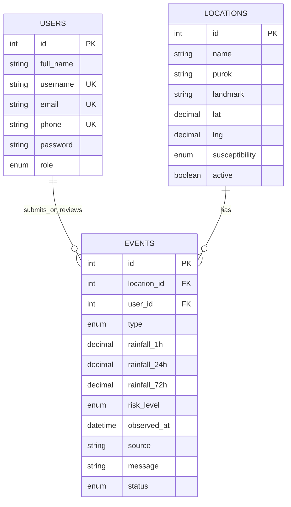

# Database and ERD explanation

The current schema is defined in `database/schema.sql`. It uses three InnoDB tables in `smartslope_mvp`. The `events` table holds both provider readings and resident reports; `events.type` separates those row types. This is a compact academic design, not a sensor-ingestion schema.

## Entity relationship

`events.user_id` points to the submitting user for reports and may be null for provider readings. `events.location_id` is required. The schema sets location deletion to cascade and user deletion to set the event's user reference to null; the UI normally deactivates a location to preserve useful history.

## Main fields

### `users`

`id` is the unsigned integer primary key. `username`, `email`, and `phone` are unique. `password` stores the PHP password hash, never the plain-text password. `role` is `admin` or `user` and defaults to `user`.

### `locations`

Stores a named Irisan map point, optional purok and landmark, latitude/longitude, a susceptibility enum and active flag. The default susceptibility is `unknown`. The coordinate pair has a unique key. A manually entered class is not treated as verified hazard evidence by the current assessment code.

### `events`

`type='reading'` rows store Open-Meteo-derived weather/rainfall fields, risk category, observation time, source, forecast context, and current/archived state. `type='report'` rows store message, contact phone/email, landmark, report type, optional occurrence time, status and review metadata. Both types use the required location reference. Awareness columns retain rule version, rainfall-window end, normalized provider payload, risk-adjustment log, report type, occurrence timestamp, reviewer and review timestamp. `provider_payload` and `adjustment_log` are not returned by ordinary JSON reading responses.

Dates are saved in UTC; the interface presents Philippine time. The `stale` column remains for compatibility. Current freshness is calculated from observation time on request, not from that flag.

## Migration

For an existing current three-table database, back it up and run `php database/migrate-awareness.php`. The idempotent CLI script adds missing awareness fields and a history index. Do not reimport `database/schema.sql` over the existing database. New databases may import the schema file. A different legacy schema requires a separate conversion and validation plan.

## Deliberate limits

There is no dedicated `sensors` table, no physical-device identifier, and no separate `readings`, `reports` or `alerts` tables in this branch. The weather provider is identified by `events.source`; system notices are calculated at request time. Confirm the instructor's specific sensor-table rubric before representing this design as satisfying it.
