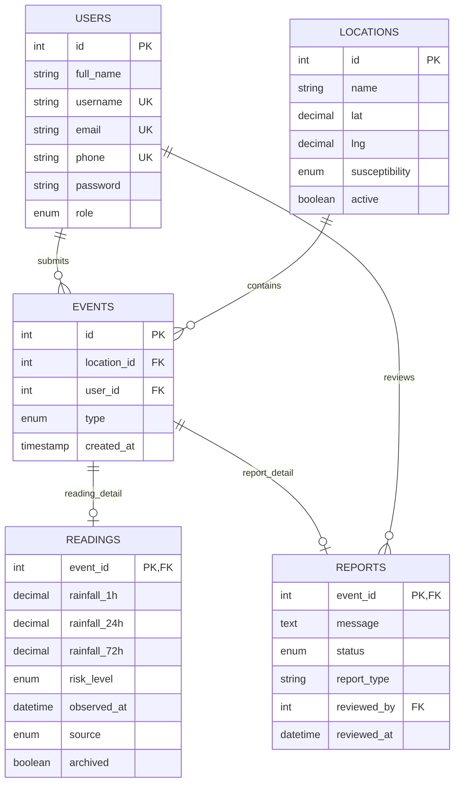

# Database, data dictionary and ERD

`database/schema.sql` defines five InnoDB tables in `smartslope_mvp`: `users`, `locations`, `events`, `readings`, and `reports`. An event holds shared identity, location, submitter, type, and creation time. The application creates a corresponding detail row for each new reading or report. `readings.event_id` and `reports.event_id` are both primary keys and foreign keys to `events.id`. The foreign keys guarantee that a detail has a parent, but do not alone enforce that every event has one detail or that its `type` matches; application and migration checks handle those rules.

## Entity relationship

The `USERS`–`REPORTS` edge uses `reports.reviewed_by`, a real foreign key with `ON DELETE SET NULL`. The `USERS`–`EVENTS` edge uses nullable `events.user_id`. The schema does not impose a constraint that an event has exactly one of the two subtype rows.

## Table fields and purpose

| Table | Identity and main fields | Role |
| --- | --- | --- |
| `users` | `id` PK; unique `username`, `email`, `phone`; `full_name`, `password`, `role`, `created_at` | Resident and admin accounts. `password` holds a PHP hash. Roles are assigned server-side. |
| `locations` | `id` PK; `name`, `purok`, `landmark`, `lat`, `lng`, `susceptibility`, `active`, `created_at`; unique coordinate pair | Saved Irisan map points. `unknown` is the default susceptibility. |
| `events` | `id` PK; `location_id` FK, nullable `user_id` FK, `type` (`reading` or `report`), `created_at` | Shared event ID and ownership. A provider reading normally has no submitting user. |
| `readings` | `event_id` PK/FK; historical 1h/24h/72h rainfall, forecast/probability, modeled soil moisture, weather context, `risk_level`, `observed_at`, `source`, rule version, window end, provider payload, adjustment log, `archived`, `stale` | One saved weather snapshot. `stale` is retained for compatibility; current freshness is calculated from observation time. |
| `reports` | `event_id` PK/FK; message, contact phone/email, house/landmark, status, report type, occurrence time, reviewer FK and review time | Resident observation and admin workflow, separate from calculated rainfall. |

`events.location_id` cascades on location deletion and `events.user_id` becomes null on user deletion. Deleting an event cascades to its detail row. Deleting a reviewer sets `reports.reviewed_by` to null. The UI normally deactivates locations to preserve history. Contact data is for admin review. New provider payload and adjustment history are stored for provenance; ordinary reading JSON strips these raw fields.

## Migration and backups

For a **new** database, import `database/schema.sql`. For an **existing legacy three-table** database with wide `events` rows, back it up and test on a disposable copy before running `php database/migrate-awareness.php` from the project root. The restartable migration adds missing legacy awareness columns as needed, creates `readings` and `reports`, copies subtype data while keeping event IDs, checks parent/detail presence and type, then drops old subtype columns from `events`. It does not convert an unrelated nine-table legacy schema. MySQL DDL is not fully transactional, so retain the backup and do not import the new schema over existing records. The admin page can invoke the same migration through a protected button when it detects an incomplete detail schema; the CLI is preferable for larger data sets.

Check row counts and representative fields in all five tables after migration, then run the disposable database integration test in [testing](testing.md). The migration checks row presence and type; it is not a byte-for-byte comparison of every copied value. If migration fails, stop and inspect the backup and detail rows before continuing.

## Scope

There is no `sensors` or `alerts` table. Open-Meteo is identified by `readings.source`; notices are computed when data is requested. The teacher's specific sensor-table requirement still needs agreement if it is graded in this phase. Susceptibility is separate from the rainfall rule; a manually entered label is not verified hazard mapping.
